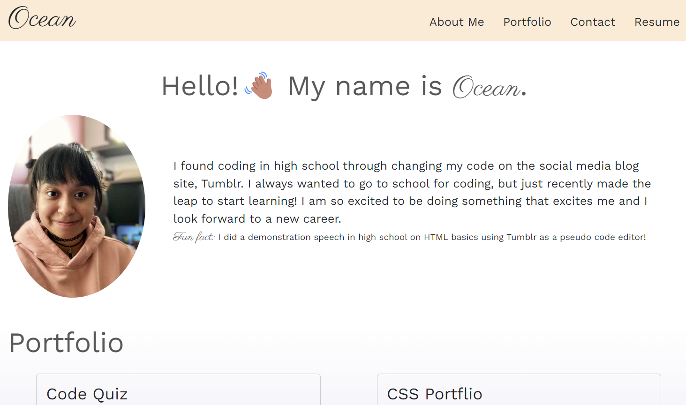

# My React Portfolio

## Description
This application is intended to showcase my skills with React.js as well as share my previous work. This is a static web page that utilizes a switch case in order to render the correct page. The layout is structured with Bootstrap flexbox and grid. 

## Built With
* React.js
* JavaScript
* Bootstrap
* CSS

## Preview
Find the finished application [here](https://oceanlatte.github.io/my-react-portfolio/)
