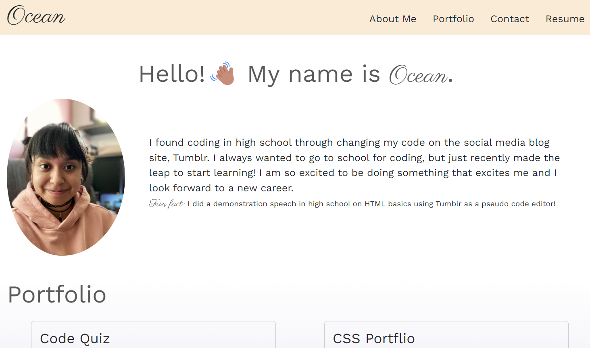
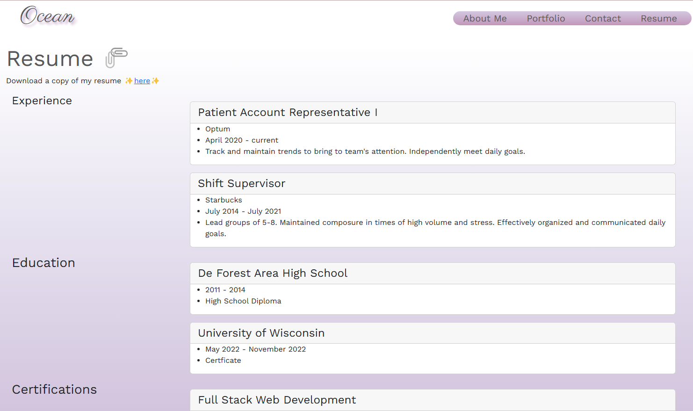

# My React Portfolio

  

## Description
This application is intended to showcase my skills with React.js as well as share my previous work. This is a static web page that utilizes a switch case in order to render the correct page. The layout is structured with Bootstrap flexbox and grid. 

### Built With
  
  
  
  

## Preview
Find the finished application [here](https://oceanlatte.github.io/portfolio/)

Find the finished application [here](https://oceanlatte.github.io/my-react-portfolio/)

## Contact
   

### License
Distributed under the MIT License. See `LICENSE.txt` for more information.